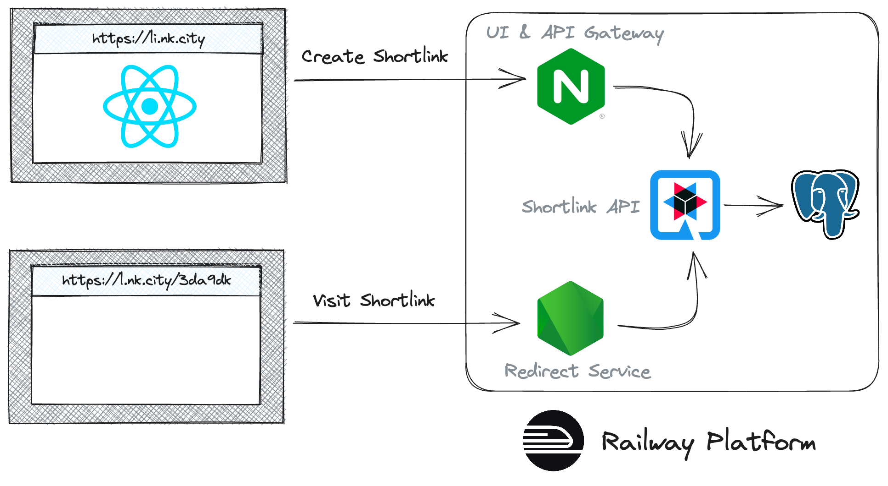

# Quarkus, NGINX, and React on Railway

This is a sample application that demonstrates various features of the
[railway.app](https://railway.app) platform.

By deploying and using it you'll learn how to:

* Use the [`railway` CLI](https://docs.railway.app/develop/cli) for local development.
* Leverage [Monorepo Support](https://docs.railway.app/deploy/monorepo) and configure [Watch Paths](https://docs.railway.app/deploy/builds#watch-paths) to:
  * Build and deploy (using Nixpacks) a Node.js application that uses [Express framework](https://expressjs.com/). 
  * Build and deploy (using Nixpacks) a modern Java application that uses the [Quarkus framework](https://quarkus.io/). 
  * Build and deploy (using Dockerfile) a React application that's served by NGINX.
  * Build and deploy (using Dockerfile) a Postgres clean up job.
* Use [Private Networking](https://docs.railway.app/reference/private-networking) to proxy API requests from the NGINX service to the Java application.
* Deploy and connect to a [Postgres Database](https://docs.railway.app/databases/postgresql) provided by Railway.
* Use [Cron Jobs](https://docs.railway.app/reference/cron-jobs) to update database records on a fixed interval.
* Configure and use [Variables](https://docs.railway.app/develop/variables) in builds and deployments.
* Override the `PORT` variable (see [Exposing your App](https://docs.railway.app/deploy/exposing-your-app)) to define a known port, while using Private Networking.
* Configure [Healthchecks](https://docs.railway.app/deploy/healthchecks) for applications.
* Use [Custom Domains](https://docs.railway.app/deploy/exposing-your-app#custom-domains) for your application(s).
* Use [Config as Code](https://docs.railway.app/deploy/config-as-code) to configure services.

## Architecture

<div align="center">
  </img>
</div>


## Local Development

### Prerequisites

1. Install Node.js v18 ([nvm.sh](https://nvm.sh) is a good way to install and manage Node.js on your development machine).
1. Install JDK 17 ([instructions from Red Hat](https://developers.redhat.com/products/openjdk/download#assembly-field-downloads-page-content-98235)).
1. Install the [`railway` CLI](https://docs.railway.app/develop/cli).

### Setup

Once you complete the steps in each subheading, you can visit
http://localhost:5173/ to interact with the application and create shortlinks.

#### Postgres

_NOTE: You could use an alternative Postgres during local development, but this guide will show how to connect to a remote Postgres instance provided by Railway._

Start by creating a project on [railway.app](https://railway.app) and adding a Postgres database to it.

Next, use the **+ New** icon in the top-right to create an **Empty Service** on your project screen on [railway.app](https://railway.app), then select the new service's **Variables** tab and use **Variable Reference** to add the Postgres variables.

#### React UI

This will listen on http://localhost:5173/

```bash
cd react-ui
npm ci
npm run dev
```

#### Link Shortener API

This will listen on http://localhost:8181/. Swagger API documentation will
be available at http://localhost:8181/q/dev/.

```bash
cd shortener-api

# Login to the railway CLI and select your project with the Postgres
# and empty service with Postgres variables 
railway login
railway link

railway run ./mvnw quarkus:dev
```

_NOTE: If there's an error configuring the database schema, make a one time change to `quarkus.hibernate-orm.database.generation` in application.properties to `create` then start the application again._

#### Redirector Service

This will listen on http://localhost:8080/

```bash
cd redirect-service
npm ci
npm run dev
```